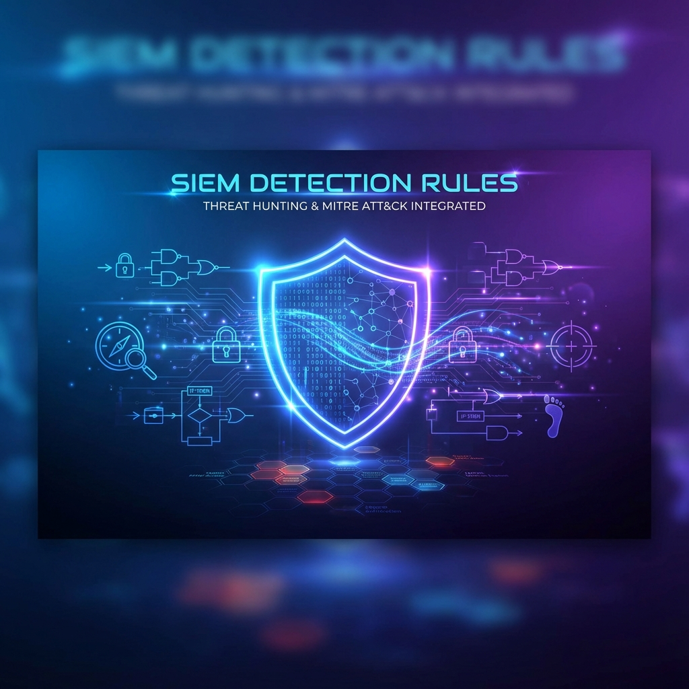

# 🛡️ Custom SIEM Detection Rules

<div align="center">



<!-- Animated Header -->
<h1>
  
</h1>

<!-- Badges -->


<br/>

**A professional collection of high-fidelity detection rules for modern SOC environments.**
<br/>
*Curated by [Ph0e-Nyx](https://github.com/Ph0e-Nyx)*

[Explore Rules](#-detection-rules) • [Implementation](#-implementation) • [Contributing](#-contributing)

</div>

---

## 📋 Overview

This repository hosts a comprehensive library of custom SIEM detection rules designed to identify advanced threats across the kill chain. Each rule is meticulously crafted, tested, and mapped to the **MITRE ATT&CK** framework.

### 🎯 Key Features

- **🔄 Multi-Platform Support**: Native rules for **Splunk** (SPL), **Elastic** (EQL/KQL), and **QRadar** (AQL), derived from a universal **Sigma** baseline.
- **🗺️ MITRE ATT&CK Integration**: Full mapping to Tactics, Techniques, and Procedures (TTPs).
- **🧪 Validated Logic**: Rules tested against real-world attack simulations (Atomic Red Team).
- **📉 Low False Positives**: Tuned to minimize noise in production environments.
- **📝 Detailed Documentation**: Each rule includes context, blind spots, and response guidance.

---

## 🔍 Detection Rules

Rules are organized by **MITRE ATT&CK Tactics**:

| Tactic | Description | Count |
| :--- | :--- | :---: |
| **[Initial Access](rules/sigma/initial_access)** | Phishing, Valid Accounts, Exploit Public-Facing Application | 3 |
| **[Execution](rules/sigma/execution)** | PowerShell, LOLBins, Scheduled Tasks | 5 |
| **[Persistence](rules/sigma/persistence)** | Registry Run Keys, Services, Account Manipulation | 4 |
| **[Privilege Escalation](rules/sigma/privilege_escalation)** | Token Manipulation, UAC Bypass | 3 |
| **[Defense Evasion](rules/sigma/defense_evasion)** | Impair Defenses, Indicator Removal, Masquerading | 4 |
| **[Lateral Movement](rules/sigma/lateral_movement)** | RDP, SMB/Windows Admin Shares, Pass the Hash | 3 |
| **[Command & Control](rules/sigma/command_and_control)** | Web Protocols, DNS Tunneling, Non-Standard Ports | 3 |
| **[Exfiltration](rules/sigma/exfiltration)** | Exfiltration Over C2, Data Staged | 2 |

> [!TIP]
> Use the **[Rule Navigator](docs/rules/README.md)** to search rules by data source or technique ID.

---

## 🛠️ Implementation

### Prerequisites

- **Python 3.8+** (for validation tools)
- **Sigma CLI** (optional, for custom conversions)

### Quick Start

1. **Clone the repository**
   ```bash
   git clone https://github.com/Ph0e-Nyx/siem-detection-rules.git
   cd siem-detection-rules
   ```

2. **Select your platform**
   Navigate to the directory matching your SIEM:
   - `rules/splunk/` for SPL queries
   - `rules/elastic/` for Elastic queries
   - `rules/qradar/` for AQL queries

3. **Deploy a rule**
   Copy the query string and import it into your SIEM's detection engine.

   *Example (Splunk):*
   ```splunk
   index=windows source="WinEventLog:Security" EventCode=4688 ProcessName="*\\powershell.exe" CommandLine="*-enc*"
   | stats count by Computer, User, CommandLine
   ```

---

## 📜 License

Distributed under the MIT License. See `LICENSE` for more information.

---

<div align="center">

**Developed with 💙 by [Ph0e-Nyx](https://ph0e-nyx.github.io)**

[](https://www.linkedin.com/in/ph0enyx/)
[](https://x.com/nieeerr_)

</div>
